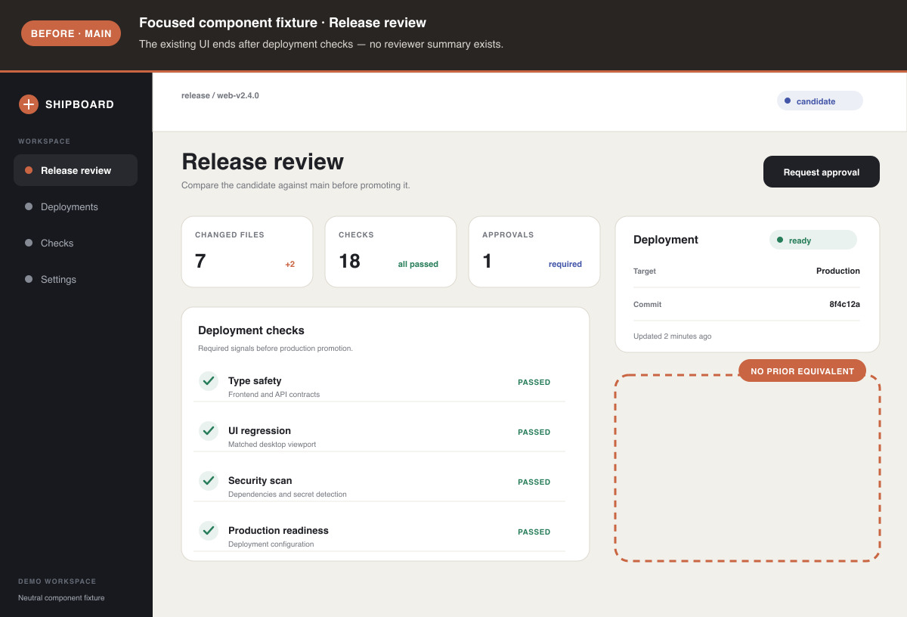
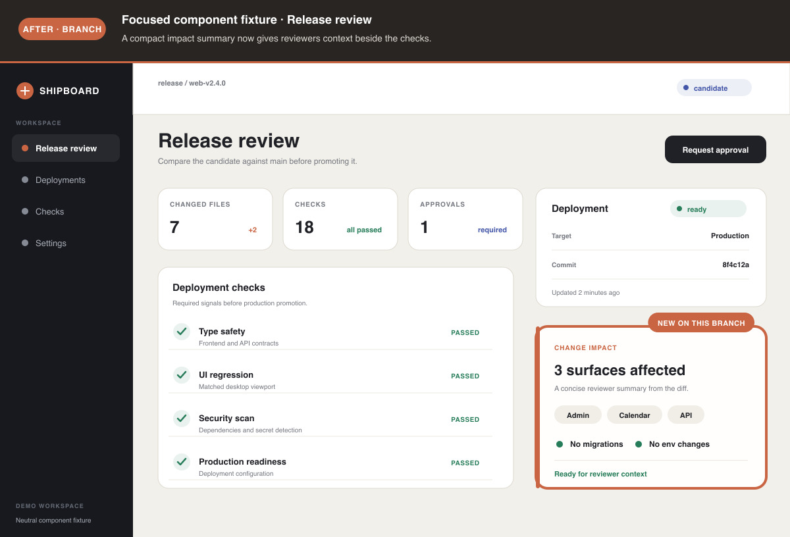

# Annotate Screenshots Skill

An agent skill for adding honest, deterministic annotations to screenshots with
[Sharp](https://sharp.pixelplumbing.com/) and SVG.

It captures or accepts an unmodified screenshot, builds a separate SVG evidence
layer, and composites the two after capture. It never injects annotation markup
into the page and never uses generative image editing.

## Showcase

This matched pair uses a neutral component fixture with no private product data.
The source UI is rendered first; every label and outline is added afterward by
the skill's Sharp + SVG renderer. Reproduce both images with
`node showcase/generate-showcase.mjs`.

### Before



### After



## Install

Install with the [Vercel skills CLI](https://github.com/vercel-labs/skills):

```bash
npx skills add madeyexz/annotate-screenshots
```

Install globally for Codex:

```bash
npx skills add madeyexz/annotate-screenshots -g -a codex
```

Install globally for Claude Code:

```bash
npx skills add madeyexz/annotate-screenshots -g -a claude-code
```

Install for both:

```bash
npx skills add madeyexz/annotate-screenshots -g -a codex -a claude-code
```

## How it works

```text
┌────────────────────────────┐
│ Codex or Claude Code       │
│ reads the installed skill  │
└─────────────┬──────────────┘
              │
              │ frames and captures
              ▼
┌────────────────────────────┐
│ Raw screenshot             │
│ unchanged PNG/JPEG pixels  │
└─────────────┬──────────────┘
              │
              │        ┌────────────────────────────┐
              │        │ JSON annotation spec       │
              │        │ header, rectangles, arrows,│
              │        │ labels, and callouts       │
              │        └─────────────┬──────────────┘
              │                      │
              │                      ▼
              │        ┌────────────────────────────┐
              │        │ Deterministic SVG overlay  │
              │        └─────────────┬──────────────┘
              │                      │
              └──────────┬───────────┘
                         ▼
              ┌────────────────────────────┐
              │ Sharp composite            │
              │ raw image + SVG evidence   │
              └─────────────┬──────────────┘
                            ▼
              ┌────────────────────────────┐
              │ Annotated PNG/JPEG         │
              │ ready for a PR or report   │
              └────────────────────────────┘
```

The browser is used only to reach, frame, and capture the raw state. Every
annotation is rendered afterward by the bundled script.

## Pair it with an agent

After installation, ask Codex or Claude Code:

```text
Use the annotate-screenshots skill to create matched before-and-after
screenshots for this UI change. Capture the real routes, add factual callouts,
and save the final assets under docs/screenshots/.
```

The skill guides the agent to:

1. Establish screenshot provenance.
2. Match viewport, filters, account, scroll position, and application state.
3. Capture raw screenshots without DOM-injected annotations.
4. Describe annotations in JSON.
5. Composite one SVG layer with Sharp.
6. Inspect the final images at full resolution.

## Annotation vocabulary

- Solid rectangle: a new or changed region.
- Dashed rectangle: an area with no prior equivalent.
- Arrow: a precise relationship or target.
- Callout: a short factual explanation.
- Header: source state, route, and comparison context.

Coordinates are relative to the raw screenshot. The renderer automatically adds
the header offset.

## Renderer runtime

The renderer uses Node.js 20.9 or newer and Sharp. It first looks for Sharp in:

1. The current project.
2. The input image's parent project.
3. The installed skill directory.

If Sharp is not already available, install the bundled runtime once:

```bash
npm install --prefix /path/to/annotate-screenshots
```

The agent can resolve `/path/to/annotate-screenshots` from the installed skill
location.

## Run the renderer directly

```bash
node /path/to/annotate-screenshots/scripts/annotate-screenshot.mjs \
  --input /absolute/path/to/raw.png \
  --output /absolute/path/to/annotated.jpg \
  --spec /absolute/path/to/annotation.json
```

Print a complete example spec:

```bash
node /path/to/annotate-screenshots/scripts/annotate-screenshot.mjs \
  --print-example
```

Example:

```json
{
  "header": {
    "height": 96,
    "badge": "AFTER · PR",
    "title": "Actual localhost /admin/analytics",
    "subtitle": "The real route now includes per-post audience analytics."
  },
  "annotations": [
    {
      "type": "rect",
      "x": 187,
      "y": 471,
      "width": 1137,
      "height": 160,
      "style": "solid",
      "label": "NEW ON THIS BRANCH"
    }
  ],
  "output": {
    "quality": 92
  }
}
```

## Repository layout

```text
showcase/
├── before.jpg
├── after.jpg
└── generate-showcase.mjs

skills/
└── annotate-screenshots/
    ├── SKILL.md
    ├── package.json
    ├── agents/
    │   └── openai.yaml
    └── scripts/
        └── annotate-screenshot.mjs
```

The layout and `SKILL.md` frontmatter follow the
[Vercel skills CLI discovery conventions](https://github.com/vercel-labs/skills#skill-discovery)
and the shared [Agent Skills specification](https://agentskills.io/).

## License

MIT
